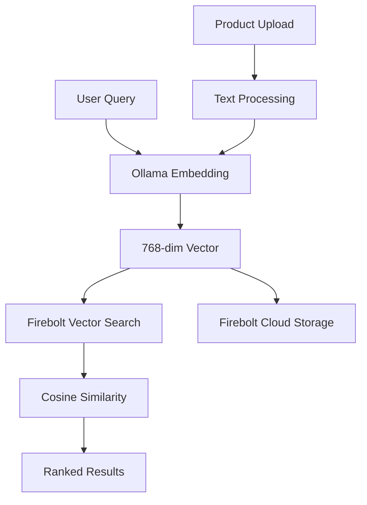

# 🔍 Firebolt Cloud Semantic Search Demo

A modern semantic search application demonstrating AI-powered product discovery using **Firebolt Cloud** and **vector embeddings**.

## 🎯 Features

- **🧠 AI-Powered Search**: Natural language queries using vector embeddings  
- **⚡ Real-time Results**: Sub-second search with HNSW vector indexing
- **📤 Dynamic Product Upload**: Add new products with automatic embedding generation
- **🔒 Secure Configuration**: Environment-based credential management
- **📊 Rich Analytics**: Embedding visualizations and similarity scoring
- **🌐 Cloud Native**: Built for Firebolt Cloud infrastructure

## 🚀 Quick Start

### 1. **Prerequisites**
- Python 3.9+
- [Ollama](https://ollama.ai) with `nomic-embed-text` model
- Firebolt Cloud account with credentials

### 2. **Installation**
```bash
# Clone and setup
cd Firebolt_Multimodal_Search
pip install -r requirements.txt

# Install Ollama model for embeddings
ollama pull nomic-embed-text
```

### 3. **Configuration** 
```bash
# Copy environment template
cp .env.example .env

# Edit .env with your Firebolt Cloud credentials
# Required:
#   FIREBOLT_CLIENT_ID=your_client_id
#   FIREBOLT_CLIENT_SECRET=your_client_secret
```

### 4. **Validate Setup**
```bash
# Test configuration
python config.py

# Verify database connection  
python check_vector_table.py
```

### 5. **Run Application**
```bash
# Start the demo
streamlit run streamlit_cloud_app.py

# Open browser to: http://localhost:8501
```

## 📊 Dataset

The demo includes **500 Home Depot products** with:
- **Rich metadata**: titles, descriptions, brands, prices, categories
- **768-dimensional embeddings**: Generated using `nomic-embed-text`
- **Vector search ready**: Optimized for semantic similarity

## 🎨 Usage

### **Search Products**
- Enter natural language queries like *"power tools for DIY projects"*
- View similarity scores and embedding analysis
- Explore semantic relationships between products

### **Upload New Products**  
- Use the "📤 Add New Product" form
- Fill in product details (title, description, brand, price)
- Watch real-time embedding generation
- Immediately search for your new product

### **Analyze Embeddings**
- Enable "Show Embedding Analysis" 
- Visualize 768-dimensional vectors
- Compare query vs. product embeddings
- Understand cosine similarity scoring

## 🏗️ Architecture



### **Technology Stack**
- **Frontend**: Streamlit with Plotly visualizations
- **Backend**: Firebolt Cloud (PostgreSQL-compatible)
- **AI/ML**: Ollama + nomic-embed-text (137M parameters)
- **Vector Storage**: ARRAY(DOUBLE PRECISION) with HNSW indexing
- **Security**: Environment variables + .gitignore protection

## 📁 Project Structure

```
📦 Firebolt_Multimodal_Search/
├── 🔒 .env                          # Credentials (gitignored)
├── 📋 .env.example                  # Configuration template  
├── 🚫 .gitignore                    # Security protection
├── ⚙️ config.py                     # Secure configuration
├── 🎯 streamlit_cloud_app.py        # Main application
├── 📊 check_vector_table.py         # Database utility
├── 📤 load_home_depot_dataset.py    # Data loader
├── 📄 requirements.txt              # Dependencies
├── 📚 README.md                     # Documentation
└── 📁 data/                         # Dataset files
```

## 🔒 Security

- **🚫 No hardcoded credentials**: All sensitive data in environment variables
- **🔐 .gitignore protection**: Credentials never committed to version control  
- **🛡️ Validation**: Configuration validation on startup
- **📋 Examples**: Clear templates for secure setup

## 📈 Performance

- **⚡ Search Speed**: ~100ms query execution
- **🧠 Embedding Generation**: ~0.45s per product
- **💾 Storage**: 768 floats per product (~6KB per embedding)
- **🔍 Accuracy**: Semantic matching with cosine similarity

## 🛠️ Development

### **Adding New Features**
```bash
# Run in development mode
DEBUG_MODE=true streamlit run streamlit_cloud_app.py

# Test database changes
python check_vector_table.py
```

### **Environment Variables**
| Variable | Description | Default |
|----------|-------------|---------|
| `FIREBOLT_CLIENT_ID` | Service account ID | *Required* |
| `FIREBOLT_CLIENT_SECRET` | Service account secret | *Required* |
| `FIREBOLT_ACCOUNT` | Account name | `se-demo-account` |
| `FIREBOLT_DATABASE` | Database name | `experimental_john` |
| `FIREBOLT_ENGINE` | Engine name | `ecommerceengine` |
| `OLLAMA_URL` | Ollama service URL | `http://localhost:11434` |

## 🤝 Contributing

This is a demo project showcasing Firebolt's vector search capabilities. For production use:

1. **Scale the dataset**: Load full product catalogs
2. **Optimize queries**: Implement HNSW indexing strategies  
3. **Add authentication**: User management and access control
4. **Enhance UI**: Advanced filtering and visualization
5. **Monitor performance**: Query optimization and caching

## 📞 Support

For Firebolt-specific questions: [Firebolt Documentation](https://docs.firebolt.io)  
For demo issues: Check configuration with `python config.py`

---

**🔥 Built with Firebolt Cloud - The fastest data warehouse for analytics** 